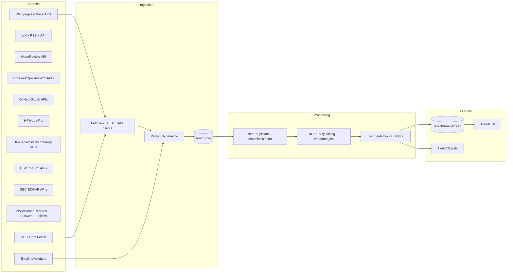
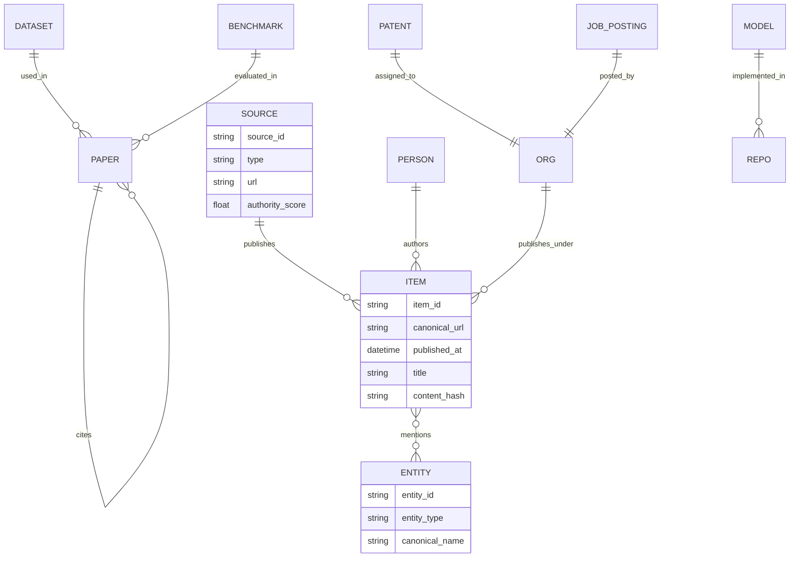

# Are 12 RSS Feeds Sufficient for High-Quality AI Trend Detection?

## Executive summary

A 12-feed RSS-only setup can be a solid **starter** for “what’s being talked about in AI news and vendor blogs,” but it is **not sufficient** for **robust trend detection** (early discovery + reliable characterization) across the AI domain. The key limitation is not just quantity; it’s **signal coverage** and **signal diversity**. Your current set mixes one primary research stream (arXiv) with several vendor/news/commentary streams, but it misses (or delays) many of the earliest and most diagnostic signals—conference submissions (OpenReview), broader preprint categories, code/model releases, benchmark movements, patents, hiring, and developer/community discourse. This creates systematic blind spots and an “echo chamber” risk where multiple feeds repeat the same stories rather than expand coverage.

The strongest evidence that the current approach will miss major trends is that many foundational AI advances appear first outside the limited slice you ingest. For example, the Transformer paper (“Attention Is All You Need”) is categorized under **cs.CL** and **cs.LG**, not cs.AI—so a cs.AI-only arXiv feed would not capture it at the source. citeturn23view0 Similarly, performance-critical systems innovations like FlashAttention are **cs.LG**, and important efficiency methods like QLoRA are **cs.LG**—again outside cs.AI-only monitoring. citeturn24view2turn24view1

RSS can also impose **latency** and **coarse timing**. arXiv’s own RSS documentation notes that feeds are **updated daily at midnight Eastern** rather than continuously, which is often too slow for fast-moving sub-trends. citeturn17view0 arXiv’s publication/announcement schedule further implies structured “batch” timing rather than true real-time dissemination. citeturn2search3

Finally, RSS reliability is uneven: in your current configuration, the **Anthropic RSS URL appears to return 404** (as observed during retrieval), meaning you may be silently losing vendor-primary updates unless you monitor feed health. citeturn3view2 Even when feeds load, they may have structural issues: Hugging Face community discussion reports their blog RSS items lacking a `<link>` element, which breaks some readers and complicates robust ingestion. citeturn4search0

Bottom line: keep RSS, but treat it as only one input channel. For trend detection, upgrade to a **multi-signal pipeline** anchored on **primary research + primary artifacts + primary governance + developer discourse**, and use RSS mostly for (a) curated editorial context and (b) vendor communications where APIs don’t exist.

## What you have today and what “12 feeds” practically means

### Current enabled feeds

Based on the configuration you described (12 enabled feeds), the set is (names as configured):

- arXiv CS.AI (`https://rss.arxiv.org/rss/cs.AI`)  
- Hugging Face Blog (`https://huggingface.co/blog/feed.xml`)  
- Anthropic Blog (`https://www.anthropic.com/news/rss.xml`)  
- Google AI Blog (`https://blog.google/technology/ai/rss/`)  
- MIT Technology Review (`https://www.technologyreview.com/feed/`)  
- The Gradient (`https://thegradient.pub/rss/`)  
- TechCrunch AI (`https://techcrunch.com/category/artificial-intelligence/feed/`)  
- VentureBeat AI (`https://venturebeat.com/category/ai/feed/`)  
- Ars Technica AI (`https://arstechnica.com/ai/feed/`)  
- The Verge AI (`https://www.theverge.com/rss/ai-artificial-intelligence/index.xml`)  
- Simon Willison (`https://simonwillison.net/atom/everything/`)  
- Interconnects (Nathan Lambert) (`https://www.interconnects.ai/feed`)

This is a reasonable blend for **headline monitoring**, but trend detection depends on whether your app needs to detect:

* “What’s popular in tech journalism right now?” (RSS-heavy can work)  
* “What’s emerging in research artifacts before the press notices?” (RSS-only will underperform)  
* “What’s changing in real-world adoption signals?” (RSS-only will miss hiring, repos, compliance, enterprise change logs)

### Baseline strengths

Your baseline includes some genuinely high-value priors:

- **arXiv RSS** is a primary research signal (but you currently sample only cs.AI). arXiv supports RSS/Atom feeds across categories and subject classes, updated daily at midnight ET. citeturn17view0  
- **Vendor blogs** (Hugging Face, Anthropic, Google) capture official launches, reference implementations, and ecosystem posture (often earlier than journalism). For example, Anthropic’s engineering and research posts can be primary indicators of tool-use, eval practice, and organizational direction. citeturn34search5turn34search11  
- **High-signal individual analysts** (e.g., Simon Willison, Interconnects) can reduce noise by curating what matters—useful as an “expert prior,” though inherently subjective and capacity-limited.

### Baseline structural weaknesses

The biggest weaknesses are systematic, not anecdotal:

- **Research coverage is too narrow** (cs.AI only). Many core AI breakthroughs land in cs.LG/cs.CL/cs.CV/stat.ML, not necessarily cs.AI (e.g., Transformer: cs.CL/cs.LG). citeturn23view0  
- **News sources correlate heavily**, causing duplication and “echo amplification.” You can see this even inside a single outlet; e.g., VentureBeat’s AI category includes many press-release-format items (Business Wire), which inflate volume but not insight. citeturn35search2turn35search5  
- **Latency and missing channels**: arXiv RSS is daily-batched, not real-time. citeturn17view0 RSS also cannot naturally represent high-velocity conversations (HN/Reddit/Bluesky), nor structured artifact updates (GitHub releases, model hub updates) without additional APIs.

## Inventory template to evaluate your 12 feeds

The table below is designed as both (a) an **audit template** and (b) a “minimum viable feed registry” you can store in your DB. Where precise values require measurement (e.g., median article length), the table indicates how to compute them.

### Feed inventory template with initial notes

| Feed (current) | Publisher | Feed URL | Topic focus | Authority metrics (suggested) | Update frequency (how to measure) | Typical length (how to measure) | Paywall status | RSS reliability checks | Sample recent headlines (examples) |
|---|---|---|---|---|---|---|---|---|---|
| arXiv CS.AI | arXiv (Cornell) | `https://rss.arxiv.org/rss/cs.AI` | CS AI research preprints | Citation impact via OpenAlex/S2; downstream citations; author/institution signals citeturn0search3turn1search1 | arXiv feeds updated daily at midnight ET citeturn17view0 | Use abstract length + linked PDF length estimate where allowed; avoid storing PDFs without rights citeturn26view0 | No | Check HTTP 200, parse validity; monitor “items/day”; compare to arXiv feed status page concept citeturn17view0 | Example varies daily; use automated “latest N titles” extraction (recommended) citeturn17view0 |
| Hugging Face Blog | Hugging Face | `https://huggingface.co/blog/feed.xml` | OSS AI ecosystem; models/tools; community + team posts | Authority via upstream citations; repo adoption; model hub trends via HF APIs citeturn9search0turn31search6 | Measure items/day + burstiness | Compute word count from fetched HTML; track read time | No (generally) | Known feed-structure issue reported: missing `<link>` in items (can break readers) citeturn4search0 | “The Future of the Global Open-Source AI Ecosystem: From DeepSeek to AI+” (Feb 3, 2026) citeturn34search9 |
| Anthropic Blog | Anthropic | `https://www.anthropic.com/news/rss.xml` | Frontier model vendor announcements | Authority: primary vendor; cross-reference with API changelogs & docs | Measure if feed reachable; otherwise migrate ingestion method | Same as above | No | Feed URL observed returning 404 during retrieval (treat as broken until fixed) citeturn3view2 | “Designing AI-resistant technical evaluations” (Jan 21, 2026) citeturn34search5 |
| Google AI Blog | Google / DeepMind | `https://blog.google/technology/ai/rss/` | Google AI product + research comms | Authority: primary vendor; cross-link to papers, model cards | Measure items/day | Same as above | No | Validate feed parse + item links | “Nano Banana 2: Combining Pro capabilities with lightning-fast speed” (Feb 26, 2026) citeturn34search12 |
| MIT Technology Review | MIT Tech Review | `https://www.technologyreview.com/feed/` | Tech journalism + analysis | Authority via newsroom reputation; but verify paywall impact | Measure items/day + %AI-tagged | Word count from HTML (may be blocked) | Often partial | Monitor fetch failures, bot blocks, paywall markers | (Auto-extract via RSS; keep “headline-only” if full text blocked) |
| The Gradient | The Gradient | `https://thegradient.pub/rss/` | Long-form technical commentary | Authority via author credentials + citations | Likely weekly-ish; measure | Usually long; compute | No | Parse title/link consistency | (Auto-extract latest) |
| TechCrunch AI | TechCrunch | `https://techcrunch.com/category/artificial-intelligence/feed/` | Startup/product news | Authority moderate; high noise; often early funding chatter | High-frequency; measure items/day | Short–medium; compute | Partial (varies) | Monitor blocks/redirects | (Auto-extract latest) |
| VentureBeat AI | VentureBeat | `https://venturebeat.com/category/ai/feed/` | Enterprise AI/news; includes press releases | Mixed: journalism + syndication/PR (noise risk) citeturn35search2turn35search5 | High-frequency; measure | Short–medium; compute | No | Track PR ratio (“Press Release”, “Business Wire”) | “Artificial Analysis overhauls its AI Intelligence Index…” (Jan 6, 2026) citeturn35search7 |
| Ars Technica AI | Ars Technica | `https://arstechnica.com/ai/feed/` | Tech reporting, often more technical | Authority moderate | Medium-frequency; measure | Medium | Partial (varies) | Monitor redirects | (Auto-extract latest) |
| The Verge AI | The Verge | `https://www.theverge.com/rss/ai-artificial-intelligence/index.xml` | Consumer/industry AI coverage | Authority moderate | Medium-frequency; measure | Medium | No | Monitor feed validity | “AI moves into the real world as companion robots and pets” (Jan 6, 2026) citeturn35news36 |
| Simon Willison | Simon Willison | `https://simonwillison.net/atom/everything/` | Practical engineering + AI tooling | Authority via technical credibility; high signal-to-noise | Medium | Medium–long | No | Typically reliable Atom | (Auto-extract latest) |
| Interconnects | Interconnects (Substack) | `https://www.interconnects.ai/feed` | AI research + policy commentary | Authority via author track record | Medium | Medium–long | Partial (Substack may gate some) | Monitor paywall flags | (Auto-extract latest) |

### How to auto-fill the “measured” columns

Use these as standard computed fields per feed:

- **Update frequency**: `items_last_7d`, `items_last_30d`, plus `median_interarrival_hours`.  
- **Typical article length**: fetch HTML → boilerplate strip → word count distribution (p50/p90).  
- **RSS reliability**: `fetch_success_rate`, `parse_success_rate`, `median_fetch_latency`, `redirect_rate`, `error_code_histogram`, `duplicate_guid_rate`.  
- **Noise and duplication**: within-feed near-duplicate rate; cross-feed near-duplicate clusters (see dedup section).

## Assessment framework and scoring rubric

A good trend system needs a repeatable way to judge whether a feed improves *trend detection*, not just “adds content.” Below is a scoring rubric designed for **AI trend detection** (not general news).

### Core dimensions

Use a 0–5 scale per dimension, then apply weights.

| Dimension | What it measures | Scoring guidance (0–5) | Weight (suggested) |
|---|---|---|---|
| Relevance | % content actually about AI methods, systems, deployments, policy | 0 = rarely AI; 5 = consistently AI and on-scope | 0.18 |
| Authority | Primary/official, or strong editorial standards; provenance clarity | 0 = anonymous/low provenance; 5 = primary source or top-tier venue | 0.18 |
| Freshness | How early it signals changes vs other channels | 0 = late reprints; 5 = consistently early | 0.14 |
| Diversity | Adds non-overlapping topics/regions/use-cases vs existing set | 0 = redundant; 5 = complementary | 0.14 |
| Noise & duplication | How much it amplifies hype/PR or repeats others | 0 = very noisy/duplicative; 5 = low-noise unique info | 0.12 |
| Technical depth | Contains methods, benchmarks, code, data, evals | 0 = shallow; 5 = deep and testable claims | 0.12 |
| Geo/language coverage | Non-US/English, or structured global coverage | 0 = monoculture; 5 = strong multi-region/multi-language | 0.06 |
| RSS/ingest reliability | Stable feed, durable IDs, consistent metadata | 0 = frequently breaks; 5 = robust | 0.04 |
| Total | Weighted sum | 0–5 | 1.00 |

**Recommended decision thresholds**
- ≥ 4.0: “Core” feed (high value, low noise)  
- 3.0–3.9: “Supporting” feed (useful context; keep with dedup)  
- 2.0–2.9: “Quarantine” (ingest but down-rank, summarize lightly, monitor)  
- < 2.0: Drop or replace

### A practical scoring workflow

Run scoring across two horizons:
- **Static assessment** (authority, scope, provenance)
- **Empirical assessment** using your own pipeline metrics: duplication rate, lead time (hours/days earlier than other sources), and “trend contribution” (how often a feed supplies the first mention in a cluster).

## Gap analysis: what RSS-only ingestion misses and why it matters

RSS-only systems tend to over-index on what is **already editorialized** and under-index on **artifact-first** and **community-first** signals. The missing categories below are where many AI trends actually begin.

### Research and evaluation signals beyond a single arXiv category

- **Most AI breakthroughs don’t live in cs.AI alone.** Transformers (cs.CL/cs.LG) are a canonical example: a cs.AI-only feed would miss it at the point of publication. citeturn23view0  
- Systems/performance innovations (e.g., FlashAttention) often sit in cs.LG, not cs.AI. citeturn24view2  
- Efficient finetuning methods (e.g., QLoRA) likewise appear in cs.LG. citeturn24view1  
- **OpenReview** is a major “preprint-before-the-preprint” venue for conference submissions/reviews (NeurIPS/ICML/ICLR). OpenReview explicitly provides APIs (API v2) and an official Python client. citeturn7search5turn10search2  

### Code, model, and dataset artifact releases

RSS from blogs rarely covers the “real” early artifacts: a repo release, a model card update, a dataset version bump, a new benchmark harness, or a library breaking change. These matter because they’re direct evidence of:
- what developers are building,
- what is deployable,
- what is being adopted.

Primary sources and structured alternatives exist:
- **Hugging Face Hub APIs** allow listing models/datasets and filtering. citeturn9search0turn31search6  
- **GitHub APIs** provide high-volume, structured signals (repos, releases, stars/forks, issues) with known rate limits (e.g., 60 req/hour unauthenticated; 5,000 req/hour authenticated) plus secondary limits. citeturn6search2  
- **PyPI RSS feeds** expose package creation and updates—useful for tracking fast adoption of agent frameworks, eval tooling, vector DB clients, etc. citeturn25search0  

### Developer/community discourse and “weak signals”

Some trends become visible first as developer discussion and “show-and-tell”:
- **Hacker News API** offers near real-time public data (official) and states there is currently no rate limit in the published docs. citeturn25search3  
- **Reddit Data API** provides structured access with defined rate limits (100 QPM per OAuth client id) and strict governance requirements (e.g., remove deleted user content; recommended deletion within 48 hours for compliance). citeturn8search0  
- **Stack Exchange API** throttles abusive rates (>30 req/sec/IP) and uses quotas plus “backoff” mechanisms, which are useful for building respectful ingestion. citeturn7search3turn7search2  
- **Bluesky** provides developer APIs for an open social network (increasingly relevant as some platforms tighten access). citeturn25search5  

### Patents, hiring, funding, and governance signals

These are essential if your “trend” definition includes commercialization and institutional change.

- **Patents:**  
  - USPTO’s PatentSearch API is a modern system with authentication requirements and explicit rate limits (45 requests/minute per API key). citeturn0search2  
  - EPO’s OPS provides access to European patent data via a RESTful interface for bibliographic and other data. citeturn18search0  

- **Public market / enterprise change:**  
  - SEC EDGAR APIs provide real-time updates to submissions and XBRL-related data via `data.sec.gov` endpoints. citeturn18search1  

- **Governance and compliance:**  
  - NIST AI RMF 1.0 and the Generative AI Profile are foundational resources; their updates and companion guidance are trend-relevant for regulated sectors. citeturn28search0turn28search2  
  - The EU AI Act text (Regulation (EU) 2024/1689) is a major regulatory driver; tracking implementing guidance, codes of practice, and enforcement timelines is trend-relevant. citeturn28search3  
  - ISO/IEC 42001:2023 is positioned as an AI management system standard (governance adoption signal). citeturn29search0  

## Prioritized recommendations: add sources and add ingestion methods beyond RSS

### Candidate sources to add

Below are **30+** candidate sources across categories. All URLs are provided in code format as requested. Selection prioritizes (a) primary/official sources and (b) structured machine-access where available.

```text
# Research & preprints (primary)
arXiv RSS (cs.LG): https://rss.arxiv.org/rss/cs.LG
arXiv RSS (cs.CL): https://rss.arxiv.org/rss/cs.CL
arXiv RSS (cs.CV): https://rss.arxiv.org/rss/cs.CV
arXiv RSS (stat.ML): https://rss.arxiv.org/rss/stat.ML
arXiv RSS (cs.RO): https://rss.arxiv.org/rss/cs.RO
arXiv RSS (cs.IR): https://rss.arxiv.org/rss/cs.IR
arXiv RSS (eess.IV): https://rss.arxiv.org/rss/eess.IV
arXiv API query endpoint (Atom): http://export.arxiv.org/api/query
OpenReview API v2: https://api2.openreview.net
OpenReview docs: https://docs.openreview.net/
NeurIPS Proceedings: https://proceedings.neurips.cc/
PMLR proceedings (ICML/AISTATS/etc.): https://proceedings.mlr.press/
ACL Anthology (RSS + data access): https://aclanthology.org/

# Scholarly metadata & citation graph (structured)
Crossref REST API: https://api.crossref.org/
OpenAlex API: https://api.openalex.org/
Semantic Scholar API: https://api.semanticscholar.org/ (see product/API pages)

# Biomedical preprints & literature (structured, primary for AI-in-health trends)
bioRxiv/medRxiv API: https://api.biorxiv.org/
NCBI E-utilities (PubMed): https://eutils.ncbi.nlm.nih.gov/entrez/eutils/

# Code, models, datasets (artifact-first signals)
GitHub REST API: https://api.github.com/
Hugging Face Hub API (models list): https://huggingface.co/api/models
Hugging Face Hub API (datasets list): https://huggingface.co/api/datasets
PyPI latest updates RSS: https://pypi.org/rss/updates.xml
PyPI newest packages RSS: https://pypi.org/rss/packages.xml
Zenodo REST API (research artifacts): https://zenodo.org/api/
Kaggle official CLI/API repo (datasets/models): https://github.com/Kaggle/kaggle-api

# Community / social / discussion (early weak signals)
Hacker News API: https://hacker-news.firebaseio.com/v0/
Reddit developer API docs: https://www.reddit.com/dev/api/
Reddit Data API Wiki (limits/policies): https://support.reddithelp.com/hc/en-us/articles/16160319875092-Reddit-Data-API-Wiki
Stack Exchange API: https://api.stackexchange.com/docs
Bluesky developer docs: https://docs.bsky.app/

# Patents & enterprise filings (commercialization + governance signals)
USPTO PatentSearch API (PatentsView): https://search.patentsview.org/api/v1/
EPO Open Patent Services: https://developers.epo.org/
SEC EDGAR APIs: https://www.sec.gov/search-filings/edgar-application-programming-interfaces

# Governance standards & regulation (policy trends)
NIST AI RMF 1.0: https://www.nist.gov/publications/artificial-intelligence-risk-management-framework-ai-rmf-10
NIST GenAI Profile: https://www.nist.gov/publications/artificial-intelligence-risk-management-framework-generative-artificial-intelligence
EU AI Act publication: https://op.europa.eu/en/publication-detail/-/publication/d79f3e5d-41bc-11f0-b9f2-01aa75ed71a1/language-en
ISO/IEC 42001 overview: https://www.iso.org/standard/81230.html
```

**Why these are high-value additions (condensed rationale):**
- arXiv RSS supports category construction and multi-category queries; expanding beyond cs.AI is the fastest way to reduce research blind spots. citeturn17view0  
- OpenReview is a primary channel for major ML conferences and is explicitly API-accessible. citeturn7search5turn10search2  
- OpenAlex and Crossref provide a scalable citation/metadata layer for authority scoring and diffusion tracking (who cites what, and how fast). OpenAlex uses an API key/credit model (large daily budget) and exposes multiple entity types. citeturn0search3turn0search7  
- GitHub + Hugging Face Hub APIs are the core artifact layer (repos, releases, model/dataset updates). citeturn6search2turn9search0turn31search6  
- Reddit/StackExchange/HN provide early discourse; Reddit additionally has strict rules + defined rate limits that drive implementation constraints (important legally/ethically). citeturn8search0turn7search3turn25search3  
- Patents/EDGAR connect AI technical trends to commercialization, governance, and real adoption. citeturn0search2turn18search1turn18search0  

### Ingestion methods beyond RSS

A robust trends app typically needs **multiple connector types**, chosen by signal structure:



**When to use which method**
- Prefer **official APIs** when they exist (OpenReview, Crossref, OpenAlex, GitHub, Reddit, SEC). This improves reliability, metadata quality, and legal clarity. citeturn7search5turn0search4turn0search3turn6search2turn8search0turn18search1  
- Use **scraping** only for sources without APIs (some news sites, some blogs, conference pages), and only with polite crawling + ToS review.  
- For newsletters, prefer **RSS where available** (Substack supports feeds); otherwise ingest via **email parsing** (inbound mailbox/webhook → structured extractor).

### Rate limits and access constraints you must design for

These are not implementation details—they shape architecture (queues, backoff, caching).

- arXiv API terms: **no more than one request every three seconds** for legacy APIs (OAI-PMH, RSS, arXiv API), and **single connection at a time**; also prohibits serving PDFs unless you have redistribution rights. citeturn26view0  
- Crossref REST API: updated limits describe **public pool 5 rps / concurrency 1** and **polite pool 10 rps / concurrency 5** (polite pool via `mailto` parameter). citeturn0search4  
- GitHub REST API: unauthenticated **60 requests/hour**, authenticated **5,000 requests/hour** (higher for some org-owned apps); secondary limits apply. citeturn6search2  
- Reddit Data API: **100 queries per minute per OAuth client id** and explicit retention/deletion obligations (remove deleted user content; recommended within 48 hours). citeturn8search0  
- Stack Exchange API: IP concurrent throttle and “backoff” behaviors; daily quota defaults (10,000/day) described in its guidance. citeturn7search3turn7search2  
- USPTO PatentSearch API: requires API key and has rate limits (45 requests/minute). citeturn0search2  
- OpenAlex API: free API key with a large daily credit budget and varying credit costs by operation. citeturn0search3turn0search6  

## Data quality, deduplication, and signal extraction techniques

Trend detection quality is usually dominated by three things: dedup, entity resolution, and temporal modeling.

### Deduplication and canonicalization strategy

Use a layered approach:

- **URL canonicalization**: strip UTM params, normalize domains, resolve redirects, canonical link tags.  
- **Exact-match fingerprints**: normalized title hash + domain + publish date bucket.  
- **Near-duplicate detection**:  
  - SimHash-like techniques are widely used to detect near-duplicate documents; SimHash originates with Charikar’s locality-sensitive hashing work and is actively used/scaled in later systems research. citeturn21search0turn21search5  
  - MinHash (Jaccard) is another standard option for near-duplicate detection and clustering. citeturn21search7  
- **Entity-level dedup**: canonicalize model names, org names, dataset names (entity linking), not just documents.

### Signal extraction techniques that work for AI trends

A strong AI trend pipeline typically uses multiple complementary methods:

- **Topic modeling for discovery / clustering**
  - Classical LDA remains a baseline for interpretable topic discovery. citeturn20search5  
  - Embedding-based topic models such as BERTopic explicitly combine transformer embeddings + clustering + class-based TF-IDF. citeturn20search3  
  Use both: LDA for stability/interpretability dashboards, BERTopic (or similar) for semantic clustering at scale.

- **Named-entity recognition + entity linking**
  Extract and normalize: organizations, models, datasets, benchmarks, chips/hardware, conferences, regulations, and people.

- **Citation/author networks**
  - Use OpenAlex or Semantic Scholar to build **paper ↔ paper**, **author ↔ author**, **institution ↔ institution** graphs and track diffusion. citeturn0search3turn1search1  
  - DBLP is also explicitly open bibliographic metadata under CC0 and mentions a query API and bulk XML. citeturn32search5  

- **Temporal burst detection**
  Kleinberg’s burst detection formalizes the idea that emerging topics show sudden frequency increases in streams (news/email/pubs). citeturn20search7  
  For AI trends, apply burst detection to:
  - entity mentions (e.g., “RAG”, “agents”, “test-time compute”)
  - artifact events (new model releases, repo stars/day)
  - citation velocity (citations/week for a new paper)

### Entity relationship model for AI trend graphs



This is the backbone for cross-signal trend detection: trends become **subgraphs that grow quickly** (more entities, more items, more cross-links) rather than just “topics that spike.”

## Evaluation metrics, monitoring plan, and implementation considerations

### Metrics that map to “trend detection” (not just ingestion volume)

Use **offline evaluation** (ground truth) plus **online monitoring**:

- **Trend precision/recall**: define a retrospective set of “true trends” (e.g., major conference themes, model release arcs, regulatory milestones) and measure whether your system detects them and when.  
- **Lead time**: how many hours/days you detect the trend before a reference source (e.g., before mainstream press).  
- **Coverage**: proportion of trends detected across categories (research, code, policy, adoption).  
- **Noise/duplication rate**: average cluster size and % near-duplicates; fraction of press releases. (VentureBeat examples show PR labeling—track this explicitly.) citeturn35search2turn35search5  
- **Freshness SLA**: p50/p95 time from source publication to ingestion, segmented by connector type.  
- **Entity quality**: precision of entity linking (spot-check), and % of items with at least one “actionable” entity.

### Monitoring plan

Operational monitoring should be first-class:

- **Feed/API health** dashboards: fetch success rate, parse errors, 4xx/5xx spikes, latency.  
  - Your config likely needs automatic quarantine when a feed breaks (Anthropic RSS returning 404 is the exact failure mode you want to detect quickly). citeturn3view2  
- **Rate-limit compliance**: centralized token buckets per source (arXiv 1 req/3 sec is strict). citeturn26view0  
- **Drift monitoring**: if a source changes templates (common), content extraction quality drops—detect via sudden word-count shifts or “empty content” rate.

### Legal and ethical considerations

This is not optional—especially for social/community sources.

- **arXiv**: metadata is CC0, but PDFs/content redistribution is constrained; the ToU explicitly warns against storing/serving e-prints unless permitted by rights/licensing, and enforces rate limits. citeturn26view0  
- **Reddit**: rate limits plus strict deletion/retention requirements; design your storage layer to support deletion propagation and short retention windows for user-generated content when required. citeturn8search0  
- **Crossref**: observe pool policies; use the polite pool with `mailto` and respect concurrency. citeturn0search4  
- **News sites/paywalls**: expect robots.txt, ToS, and paywall constraints. Architect so you can still ingest **headline + metadata** even when full text is blocked.

### Cost and tech stack implications

With no budget constraints, you can maximize quality by using:
- A queue-based ingestion system with per-connector rate controls
- A vector DB + graph DB combo (or a relational DB + graph projections) for entity networks
- A “polite crawling” service for non-API web sources
- Human-in-the-loop evaluation and weekly scoring recalibration

## Examples of trends RSS-only ingestion would likely overlook

These examples illustrate *structural* misses, not one-off mistakes:

- **Cross-category research breakthroughs**: a cs.AI-only arXiv feed misses cs.CL/cs.LG papers at source—Transformer (“Attention Is All You Need”) is cs.CL/cs.LG. citeturn23view0  
- **Systems/performance trends**: FlashAttention (cs.LG) would be missed at the preprint level, despite rapidly shaping real-world LLM deployment efficiency. citeturn24view2  
- **Conference-driven shifts**: NeurIPS/ICML submission waves, review discourse, and acceptance patterns appear first on OpenReview portals/APIs, not RSS journalism. citeturn7search5turn33search1  
- **Rapid artifact adoption**: new libraries/frameworks show up as PyPI release spikes (RSS available) and GitHub repo velocity long before they get press coverage. citeturn25search0turn6search2  
- **Community-originated phenomena**: controversial prompt-injection/jailbreak patterns, evaluation memes, or emergent workflows often surface first on HN/Reddit/StackExchange. HN is near real-time and API-accessible; Reddit has defined access rules that require careful compliance. citeturn25search3turn8search0turn7search3  
- **Regulatory compliance drift**: major governance changes (EU AI Act, NIST GenAI profile, ISO AI management standards) don’t reliably appear in tech RSS feeds early enough; they must be tracked from primary publishers. citeturn28search3turn28search2turn29search0  

---

**Key conclusion:** Keep your 12 RSS feeds as a **context layer**, but upgrade your trends app into a **multi-signal** system anchored on primary research (broader than cs.AI), primary artifacts (GitHub + model hubs), structured scholarly metadata (OpenAlex/Crossref), and adoption/governance signals (patents, EDGAR, standards/regulation). That combination is what materially improves both **coverage** and **signal quality**.